   
  
# Web application - DevOps Project

Welcome to the repository of our web application DevOps project. The goal of this project is to implement softwares covering the whole DevOps cycle to a simple API web application that uses storages in a Redis database. The softwares help us automate the building, testing, deployment and running of our project.

In this repository is explained how to set up : 
* The User API web application
* A CI/CD pipeline with GitHub Actions and Heroku
* A Vagrant configured virtual machine provisionned with Ansible
* A Docker image of our application
* Container orchestration using Docker Compose
* Docker orchestration using Kubernetes
* A service mesh using Istio
* Monitoring with Prometheus and Grafano to the application containerized in a K8s cluster
  
  
# 1. Web application

The app is a basic NodeJS web application exposing REST API where you can create and store user parameters in a [Redis](https://redis.io/) database.  
You can create a user by sending a curl POST method to the application with the user data, and access that data in the app in the http://localhost:8080/user route and adding to the route /username with the username corresponding the user data you want to access.  

## Installation

This application is written on NodeJS and it uses a Redis database.

1. [Install NodeJS](https://nodejs.org/en/download/)
2. [Install Redis](https://redis.io/download)
3. Install application

Go to the userapi/ directory of the cloned repository and run:

```
npm install 
```

## Usage

1. Start a web server

From the /userapi directory of the project run:

```
npm run start
```

It will start a web server available in your browser at http://localhost:8080.

2. Create a user

Send a POST (REST protocol) request using terminal:

```bash
curl --header "Content-Type: application/json" \
  --request POST \
  --data '{"username":"sergkudinov","firstname":"sergei","lastname":"kudinov"}' \
  http://localhost:8080/user
```

It will output:

```
{"status":"success","msg":"OK"}
```  
After, if you go to http://localhost:3000/user/sergkudinov, with "sergkudinov" being the username that you had in your POST data, it will display in the browser the following, with correspondance to the data that you posted:  
```
{"status":"success","msg":{"firstname":"sergei","lastname":"kudinov"}}
```


Another way to test your REST API is to use [Postman](https://www.postman.com/).

## Testing

From the root directory of the project, run:

```
npm run test
```  
  
It should pass the 12 tests:  

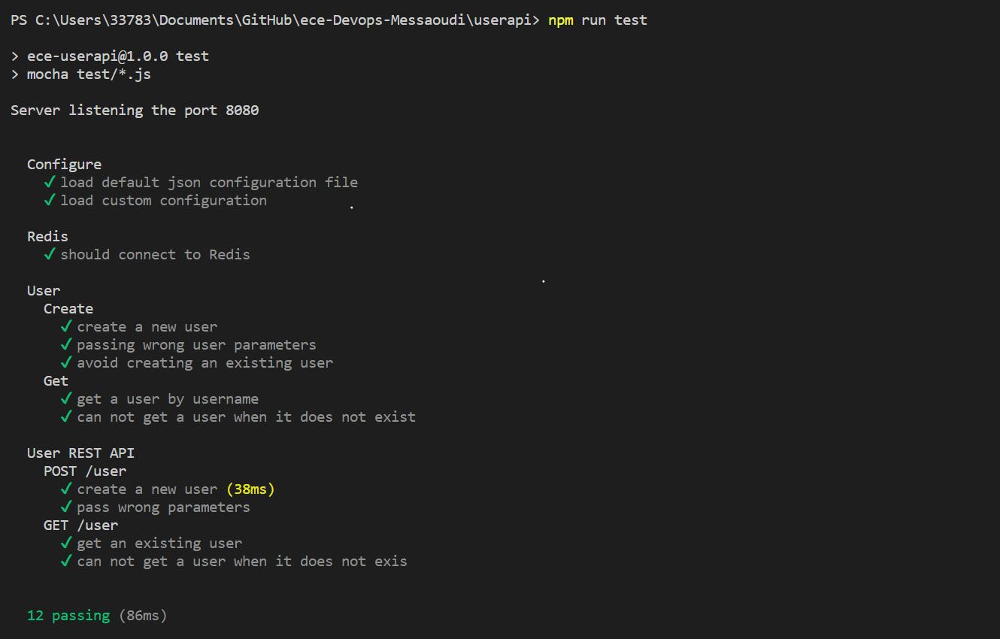

> **Note!** You need to run a **redis server** before testing. If you dont, the connection would be aborted and display an error message as below :
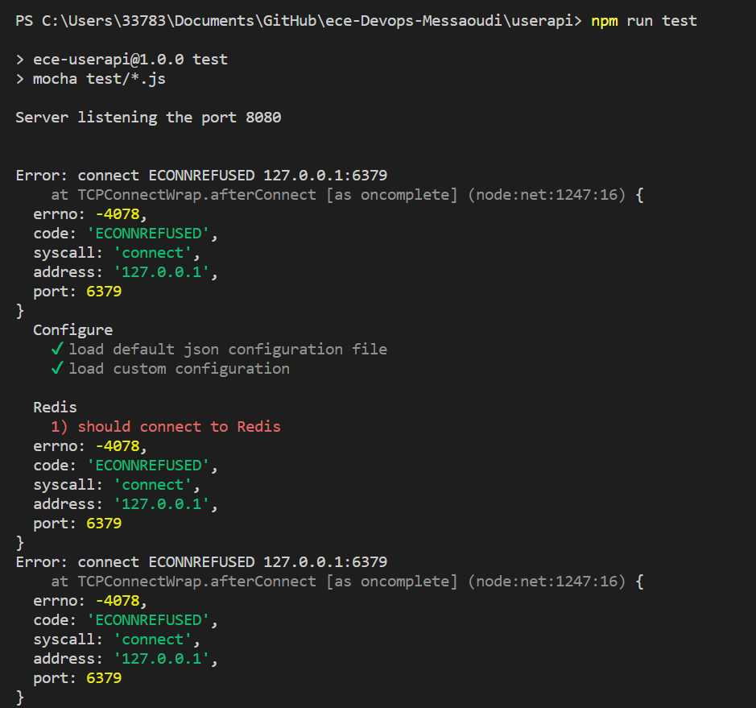


# 2. CI/CD pipeline with GitHub Actions and Heroku

* The continuous integration workflow has been setup with GitHub Actions.  
The workflow automates building and tests of our NodeJS project. Before every deployment we check if the workflow tests have passed successfully to make sure the code runs correctly. 

* The continuous deployment has been done with Heroku.  
Heroku helps us deploying our project and allows automatic deployment. We had to add Heroku to our GitHub Actions workflow.   
  
We created our workflow using Github Action provided template for Heroku and the ressources of  [Deploy to Heroku](https://github.com/marketplace/actions/deploy-to-heroku)

  
We then in the main.yaml have put this code:
```yaml
# This workflow will do a clean install of node dependencies, cache/restore them, build the source code and run tests across different versions of node
# For more information see: https://help.github.com/actions/language-and-framework-guides/using-nodejs-with-github-actions

name: Node.js CI

on:
  push:
    branches: [ main ]
  pull_request:
    branches: [ main ]

jobs:
  build:

    runs-on: ubuntu-latest
    defaults:
      run:
        working-directory: userapi

    strategy:
      matrix:
        node-version: [10.x, 12.x, 14.x, 15.x]
        redis-version: [4, 5, 6]
        
    steps:
    - name: Git checkout
      uses: actions/checkout@v2

    - name: Use Node.js ${{ matrix.node-version }}
      uses: actions/setup-node@v1
      with:
        node-version: ${{ matrix.node-version }}

    - name: Start Redis
      uses: supercharge/redis-github-action@1.4.0
      with:
        redis-version: ${{ matrix.redis-version }}

    - run: npm install
    - run: npm test

  deploy:
      
      needs: build
      runs-on: ubuntu-latest

      steps:
        - uses: actions/checkout@v2
        - uses: akhileshns/heroku-deploy@v3.12.12 # This is the action
          with:
            heroku_api_key: ${{secrets.HEROKU_API_KEY}}
            heroku_app_name: "devops" #Must be unique in Heroku
            heroku_email: "fares.messaoudi@edu.ece.fr"
            appdir: userapi    
    
```

  The heroku_app_name is the name of the Heroku app that we have created in Heroku's website. The API key was retreaved from the Heroku account setting and had to be added in the GitHub secrets. This allows for automatic deployment on Heroku after we any push to GitHub.  
    
  We have also, in the Heroku app's deployment settings, enabled automatic deploys and ticked the "Wait for CI to pass before deploy" checkbox.  
    
We can check for ourselves the tests in the CI/CD workflow of our GitHub project: 

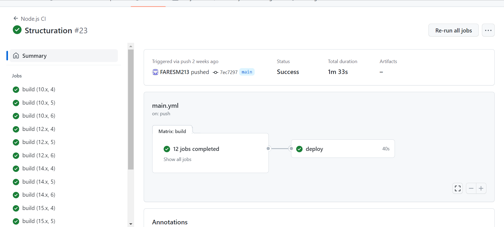

After CI/CD confirmation, we can also have an access from the Heroku project and get access to the app :

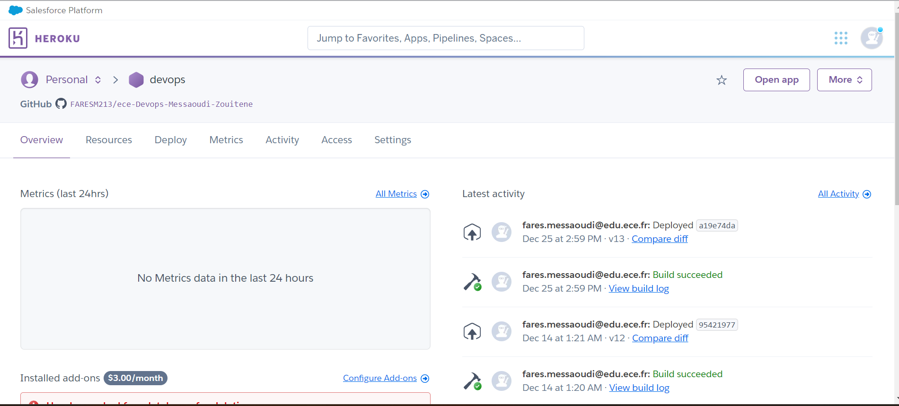
  
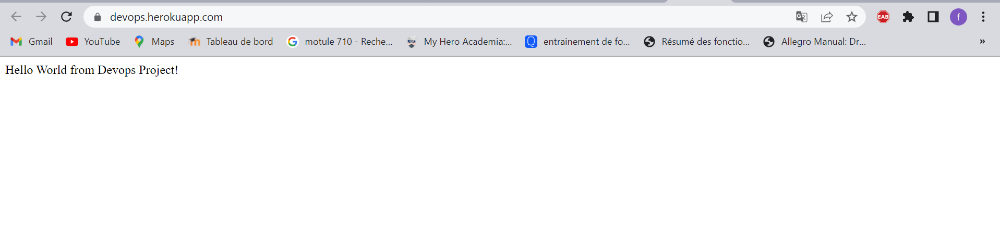  

# 3. Configuring and provisionning a virtual environment using the IaC approach

To use the Infrastructure as code (IaC) approach, we have used Vagrant to configure and manage our virtual machine and used Ansible to provision the virtual machine. 

## Installation

For this, in addition to installing Vagrant, you have to make sure you have installed VirtualBox (or another [virtualization software that is accepted by Vagrant](https://www.vagrantup.com/docs/providers)).

1. [Install VirtualBox](https://www.virtualbox.org/wiki/Downloads) (or other)
2. [Install Vagrant](https://www.vagrantup.com/downloads.html)  
  

## Creating and provisionning the virtual machine (VM)  

* Go to the [/IaC](/iac) directory (where there is the [Vagrantfile](/iac/VagrantFile)) and run in the terminal:

```bash
vagrant up --provision
```  
  It should start initializing and booting the VM.  
    
  The VM's OS is centos/7 which is a basic, highly optimized and small in size version of Ubuntu 18.04 64-bit available for minimal use cases and made by HashiCorp. You can choose whatever OS you want to use in your VM by modifying the VM box property. Ressouces are available online about the [Vagrantfile](https://www.vagrantup.com/docs/vagrantfile) and how to change [boxes](https://www.vagrantup.com/docs/boxes).  
    
  Then it will download automatically Ansible and will start the provisionning set up by the Ansible playbooks. The playbooks' tasks set up the downloading and enabling of the packages and services that are needed to run the userapi project on the VM. 

  This installation is executed by the VagrantFile wich use the [Run.yml](iac/playbooks/run.yml) and the [Install.yml](iac/playbooks/roles/app/install/tasks/main.yml) to install all the necessary dependencies :

 ```VagrantFile
 # -*- mode: ruby -*-
# vi: set ft=ruby :

Vagrant.configure("2") do |config|

    # Do not pay attention to this parameter
    if Vagrant.has_plugin?("vagrant-vbguest")
      config.vm.provider :virtualbox do |vb|
        config.vbguest.auto_update = false
      end
    end
  
    config.vm.synced_folder "../userapi/", "/devopsapi"
    # Define the gitlab_server VM
    config.vm.define "Devops_server" do |server|
      # Specify the Vagrant box to use
      server.vm.box = "ubuntu/focal64"
      # Specify the VM ip address
      config.vm.network "forwarded_port", guest: 80, host: 8000
      # Specify the VM specs when using the Virtualbox provisioner
      server.vm.provider "virtualbox" do |vb|
        vb.name =  "Devops_server.server.local"
        # VM RAM in MB
        vb.memory = 2048
        # VM CPUs
        vb.cpus = 1
      end
      config.vm.provider "vmware_desktop" do |vmware|
        vmware.vmx["memsize"] = "2048"
        vmware.vmx["numvcpus"] = "1"
      end
    end
        # Use Vagrant Ansible provisioner
        config.vm.provision "ansible_local" do |ansible|
            # The path to the playbooks entry point
            ansible.playbook = "playbooks/run.yml"
            ansible.tags = "install"
          end
  end
  
 ```

You should end up with this confirmation message :

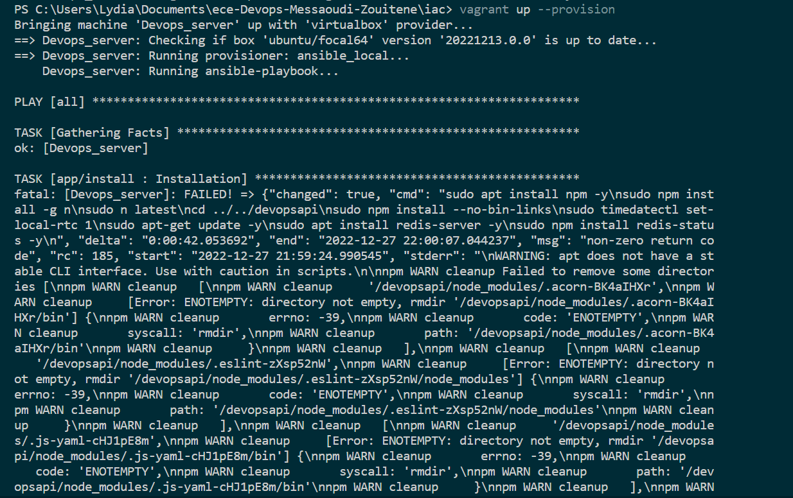
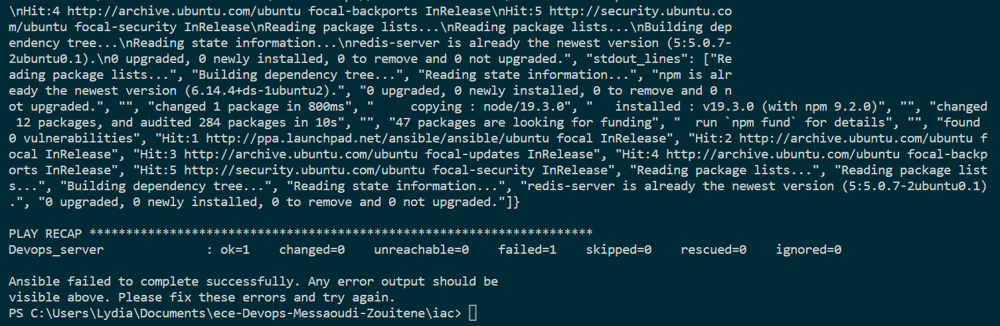

* After the downloads have ended, you can enter your VM via SSH with the following Vagrant command:  
```bash
vagrant ssh 
```  
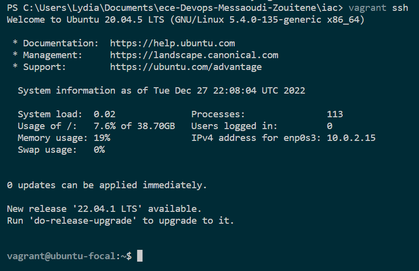

  The folder userapi located in the repository's clone of your host is shared with the VM thanks to the "synced_folder" folder property in the [Vagrantfile](iac/VagrantFile).  
  * When connecting by SSH, you can find the folder by typing the following commands in the terminal: 
  
```bash
cd ../..
cd home/devopsapi/
/home/devopsapi ls
```  
You can see that the files being showen by the terminal are the same than the one in the host's folder.   
   
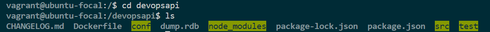

We have also kept in the roles folders a "main.yaml" file with tasks for the installation and launch of GitLab on the VM that works fine. If you want to use it you have to go to /part-2, lunch the VM like above. When installed and launched on the VM, you will be able to access the GitLab page through the 20.20.20.2 address on your host machine thanks to the server.vm.network and ip properties in the [Vagrantfile](part-2/Vagrantfile). You should have this response :

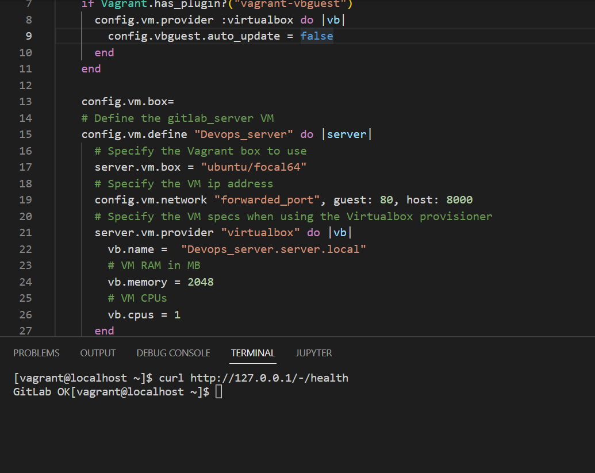

We also created our own health check and configure routes to verify the app's wellbeing. Thus, you can consulte the [Health](iac/playbooks/roles/app/healthchecks/tasks/main.yml) and [Readiness](iac/playbooks/roles/app/healthchecks/tasks/main.yml) checks wich respectly verifies the well running and theredis communication

Run the checks with the following command :

```bash
  ansible-playbook /vagrant/playbooks/run.yml --tags check -i /tmp/vagrant-ansible/inventory/vagrant_ansible_local_inventory
```  
You sould get a 'Application correctly running ' message and 'great' if the checks pass the health and readiness tests : 

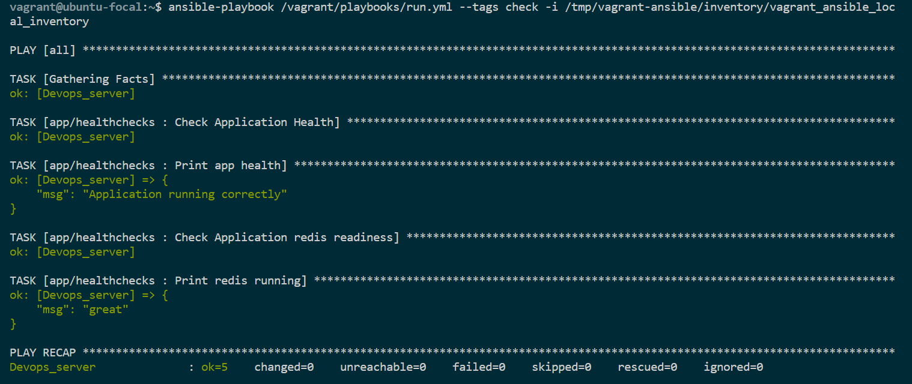


> **Note!** Don't forget to start the **application** before testing. If you dont, the connection would be aborted and you will not pass the test. Go to the /devopsapi folder in vagrant and npm start & :

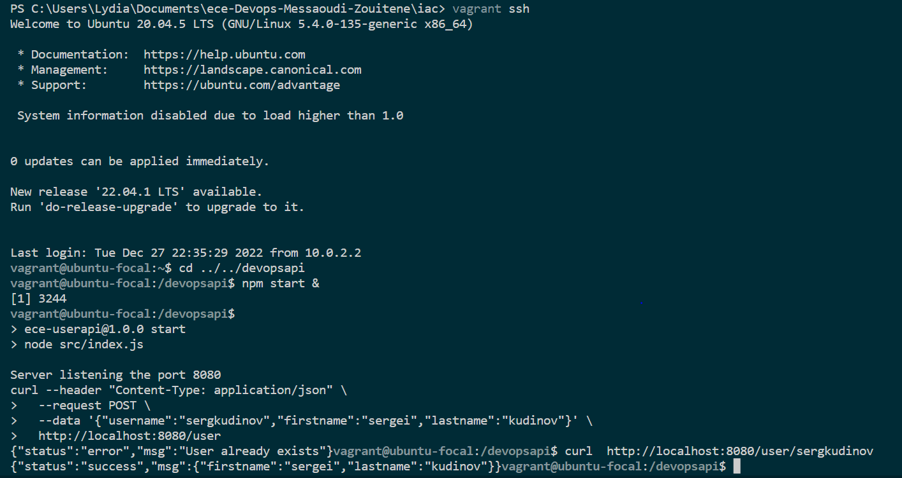

* Try to add a user and curl it to test the redis connexion 

You can also try the following to get the same checks as above. 

```bash 
curl http://localhost:8080/health
``` 
or / and

```bash 
curl http://localhost:8080/rediness
```


 
# 4. Docker image of the app

To be able to "containerize" our application we created a Docker image of it. Docker enables us to run our app in the exact environment(s) that we want.

## Installation
Install [Docker Desktop](https://www.docker.com/get-started)  
  

* Inn the [userpai](userapi) diretory (where there is the [Dockerfile](userapi/Dockerfile)), run the following command to build image (don't forget the dot):
```bash
docker build -t userapi .
```    
  
We have also pushed our Docker image to DockerHub.  

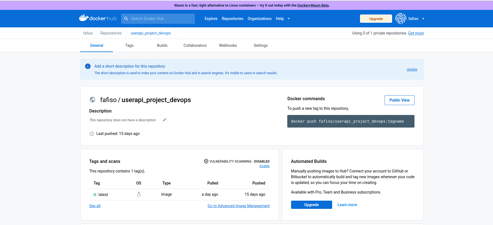  

* So, instead, you can simply pull the image from DockerHub: 
```bash
docker pull fafiso/devops_userapi
```    

* You can check if it appears in your local Docker images:
```bash
docker images
```    

* Then, run the container:
```bash
docker run -p 8080:8080 -d fafiso/devops_userapi
```   
  
* Check if it the container is running:
```bash
docker ps
```  

* By going to http://localhost:8080/, the welcome page of the app will showup:  

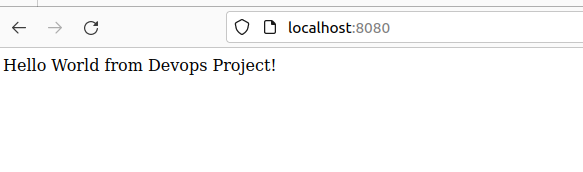  
> **Note!** Don't forget to start the **redis-server** before testing. If you dont, the connection would be aborted.

* Stop the container:
```bash
docker stop <CONTAINER_ID>
```  
Hence,everyone can pull the contenarised image of our application to run its own loacl machine

# 5. Container orchestration using Docker Compose

The image we have built with the Dockerfile runs only a container which has our app but not the database.  
  
Docker Compose allows us to run multi-container Docker applications. The services and images are set up in the [docker-compose.yaml](docker-compose.yaml) file.  

* Run the docker-compose command to create and start the redis and web services from the configuration file:  
```bash
docker-compose up
```   
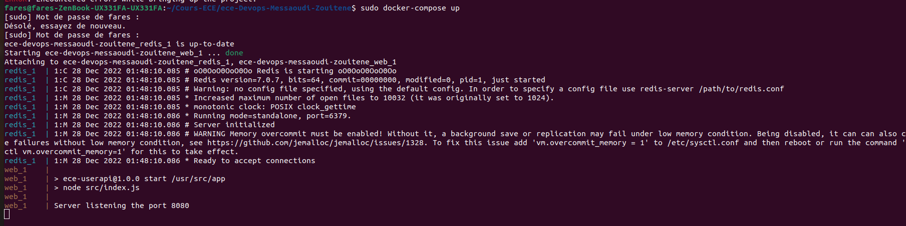  


* By going to http://localhost:3000/, the welcome page of the app will showup:  

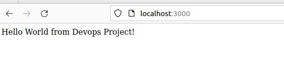  

* You can delete the containers with:
```bash
docker-compose rm
```   
Then Try the **Usage** section of p **Web App** part to check the database communication.

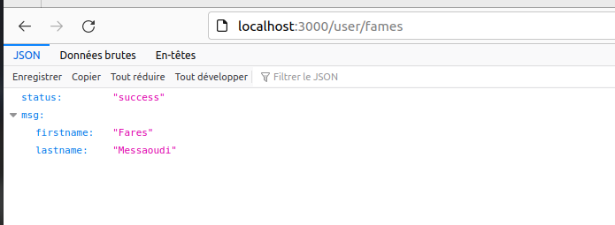  

# 6. Docker orchestration using Kubernetes 

Kubernetes is an open-source system for automating the deployment, scaling and management of containerized applications. Compared to Kubernetes, Docker Compose has limited functionnality.  
  

## Install Minikube
Minikube is a tool that makes it easy tu run Kubernetes locally. 
  
[Install Minikube](https://kubernetes.io/docs/tasks/tools/install-minikube/) following the instructions depending on your OS.  

* Start Minikube: 
```bash
minikube start
```   
> **Note!** If you dont have exactly the below output, make sur to have at least a " Done " sentence. If you encounter some issues, try to reinstall [Docker](https://www.docker.com/get-started) or [Minikube](https://kubernetes.io/docs/tasks/tools/install-minikube/) with all its dependencies 


* Check that everything is OK:
```bash
minikube status
```  

You should the following : 

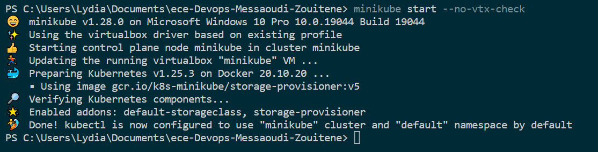


## Running the Kubernetes deployments

* Go to the [/k8s](/k8s/) directory and run this command for every file:
```bash
kubectl apply -f <file_name.yaml>
```  
* The deployment.yaml file describes the desired states of the redis and userapi deployments.  
* The service.yaml file exposes the redis and userapi apps as network services and * gives them the right ports.
* The persistentvolume.yaml file creates a piece of storage in the cluster which has a lifecycle independent of any individual Pod that uses the PersistentVolume.
* The persistentvolumeclaim.yaml file create a request for storage by a user.  
  
## Check that everything is running 
* Check that the deployments are running:
```bash
kubectl get deployments
```  
The result should be as following:  
  
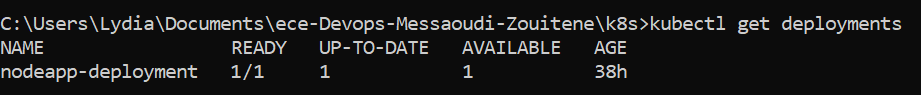  

* Check that the services are running:
```bash
kubectl get services
```
Should output the following:
  
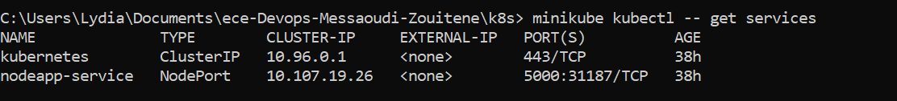  
  
* Check that the PersistentVolume is running:
```bash
kubectl get pv
```
Outputs the following:
  
  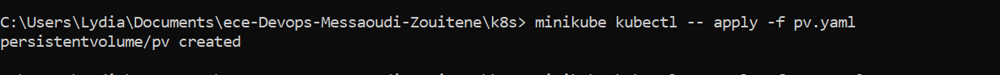  
  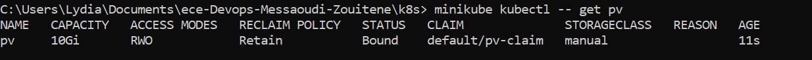  
  
* Check that the PersistentVolumeClaim is running:
```bash
kubectl get pvc
```
Outputs the following:  
      
  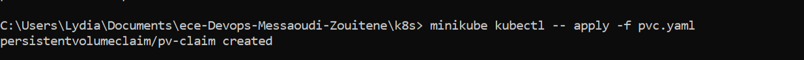  
  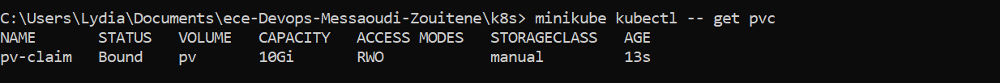  
 
    
We can see in the outputs that the PersistentVolumeClaim is bound to the PersistentVolume. The claim requests at least 3Gi from our hostPath PersistentVolume.  
  

## Accessing the containerized app

* Run the following command to the nodeapp service:
```bash
 kubectl port-forward service/nodeapp-deployment 3000:3000
```  
  
The home page of our app should display when going to http://localhost:3000/ on your browser.

* Run the following command:
```bash
kubectl get pods
```  

# 7. Making a service mesh using Istio

Istio is a service mesh that can control the traffic flow between micro-services.  
For example, it can be used to redirect a parts of the users into different versions of a service.  
  
## Installation  
  
* Make sure you have Minikube installed and run:
```bash
minikube config set vm-driver virtualbox (or vmware, or kvm2) 
#or minikube config set vm-driver virtualbox
minikube start --memory=16384 --cpus=4 --kubernetes-version=v1.18.0 
#configure the RAM and CPU usage according to your system
```    
  
Intructions: https://istio.io/docs/setup/getting-started/  
  
Follow the installation instructions until the [Deploy the sample application](https://istio.io/latest/docs/setup/getting-started/#bookinfo) section.  


## Yaml Deployment files

For this part, we have decided to change our deployment.yaml and services.yaml to have a better distinction between the 2 differents pods redis and node.js. With Istio, we are going to try to route requests between 2 different version of our app. So, in the istio folder, we have changed the deployment.yaml file andd doubled the nodeappi et redis deployments, so now we have 4 deployments.Two of them linked to the version "v1" and the others to second one "v2".

* Run the following command in the /istio directory for each file in the folder:  
```bash
kubectl apply -f <file_name.yaml>
```   
  
## Routing  

* Default routing
  
By applying virtual services, we can set the default version the microservices that we want. In the [Service-virtual.yaml](istio/Service-virtual.yaml) file, we have set the version v1 for redis and for userapi as the default version:  
  
```yaml
apiVersion: networking.istio.io/v1alpha3
kind: Service
metadata:
  name: redis-service
spec:
  hosts:
  - redis-service
  http:
  - route:
    - destination:
        host: redis-service
        subset: v1
---
apiVersion: networking.istio.io/v1alpha3
kind: VirtualService
metadata:
  name: nodeapp-service
spec:
  hosts:
  - nodeapp-service
  http:
  - route:
    - destination:
        host: nodeapp-service
        subset: v1
```  
  
* User identity based routing  
  
With the [Service.routing.yaml](istio/Service_routing.yaml) file, we applied a virtual service to have a user based routing.   
  
```yaml
apiVersion: networking.istio.io/v1alpha3
kind: VirtualService
metadata:
  name: nodeapp-service
spec:
  hosts:
    - nodeapp-service
  http:
  - match:
    - headers:
        username:
          exact: lydia
    route:
    - destination:
        host: nodeapp-service
        subset: v1
  - route:
    - destination:
        host: nodeapp-service
        subset: v2
```  
  
For our service nodeapp-service, all the connections that are sending an HTTP request with the username equal "lydia" in its header will be sent to nodeapp-service:v2.

## Traffic shifting  
  
Traffic shifting is usually used to migrate traffic gradually from an older version of a microservice to a new one. You can send a part of the whole traffic to be sent to the version of the micro-services of your choice.  
  
The [Service_Traffic.yaml](istio/Service_Traffic.yaml) file applies a virtual service that redirect 50% of traffic into the v1 of the userapi deployment and the other 50% into the v2 of nodeapp-service:  
  
```yaml
apiVersion: networking.istio.io/v1alpha3
kind: VirtualService
metadata:
  name: nodeapp-service
spec:
  hosts:
    - nodeapp-service
  http:
  - route:
    - destination:
        host: nodeapp-service
        subset: v2
      weight: 50
    - destination:
        host: nodeapp-service
        subset: v1
      weight: 50
```  

# 8. Monitoring containerized application with Prometheus and Grafana  

Isitio being a service mesh that identifies the amount of traffic comming into micro-services, it gives also the possibility to monitorize our containerized application thanks to its many addons and packages that can be installed.  
  
## Installation  
  
Follow the same [installation guide](https://istio.io/docs/setup/getting-started/ ) than in the last part but stop at the [View the dashboard](https://istio.io/latest/docs/setup/getting-started/#dashboard) part. 


## Prometheus  
  
Follow intructions for the installation of Prometheus: https://istio.io/latest/docs/ops/integrations/prometheus/   

  Prometheus is installed through Istio thanks to addons. Prometheus works by scrapping the data emitted by the Istio service mesh to be able to generate its dashboard. To make it work, you must customize Promeheus' scrapping configurations. Scrapping configurations are provided in the above guide for to scrape Istio's http-monitoring port and Envoy stats. TLS Settings are also provided to scrape using Istio certificates.


## Grafana  
  
Follow intructions for the installation of Grafana: https://istio.io/latest/docs/ops/integrations/grafana/  
  
  Grafana is also installed through Istio's addons. To create it dashboard, Grafana can import Istio's dashboard through a script that is provided in the above guide. Grafana can be also installed and configured through other methods. There is documentation in the guide to import Istio dashboards with other intallation methods of Grafana.