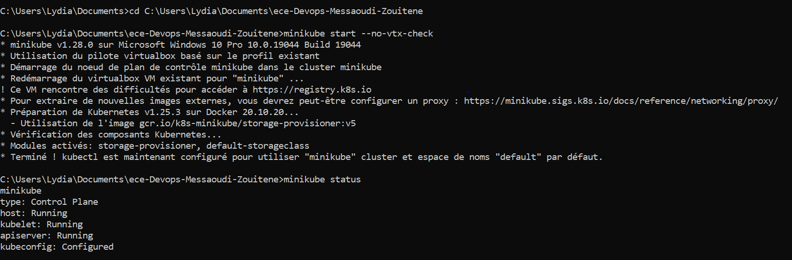

   
  
# Web application - DevOps Project

We are pleased to present our DevOps web application repository. The goal of this project is to implement software that covers the whole DevOps cycle on a simple API web application that uses a Redis database for storage. These tools will assist us in building, testing, deploying, and running the project smoothly.

This repository explains how to set up:

A Vagrant configured virtual machine provisioned with Ansible is shown in this repository, as is the User API web application, the CI/CD pipeline with GitHub Actions and Heroku, the Docker image of our application, container orchestration with Docker Compose, container orchestration with Kubernetes, and service meshing with Istio are also described. Prometheus and Grafano are used to monitor a containerized application in a K8s cluster.
  
  
# 1. Web application

An application based on NodeJS that exposes a REST API that allows you to create and store user parameters in Redis (https://redis.io/). The application can be created by sending a curl POST method with the user data, and the data can then be accessed in the app via the http://localhost:8080/user route by adding the username corresponding to the user data you want to access.

## Installation

NodeJS is the used language in this application, and Redis is used as a database.

1. [Install NodeJS](https://nodejs.org/en/download/)
2. [Install Redis](https://redis.io/download)
3. Install application

## Usage

1. Start a web server

From the /userapi directory of the project run:

```
npm run start
```

It will start a web server available in your browser at http://localhost:8080.

2. Create a user

Send a POST (REST protocol) request using terminal:

```bash
curl --header "Content-Type: application/json" \
  --request POST \
  --data '{"username":"sergkudinov","firstname":"sergei","lastname":"kudinov"}' \
  http://localhost:8080/user
```

It will output:

```
{"status":"success","msg":"OK"}
```  
After, if you go to http://localhost:3000/user/sergkudinov, with "sergkudinov" being the username that you had in your POST data, it will display in the browser the following, with correspondance to the data that you posted:  
```
{"status":"success","msg":{"firstname":"sergei","lastname":"kudinov"}}
```


Another way to test your REST API is to use [Postman](https://www.postman.com/).

## Testing

From the root directory of the project, run:

```
npm run test
```  


> **Note!** You need to run a **redis server** before testing. If you dont, the connection would be aborted and display an error message as below :


# 2. CI/CD pipeline with GitHub Actions and Heroku

* Heroku.  
We used Heroku for continuous deployment. Heroku allows us to deploy our project automatically. We had to add Heroku to our GitHub Actions workflow.

* GitHub Actions.  
With GitHub Actions, we have set up our continuous integration workflow, which automates the building and testing of our NodeJS project. To ensure that the code runs correctly before deployment, we check if the workflow tests pass. 


main.yaml code:
```yaml

name: Node.js CI

on:
  push:
    branches: [ main ]
  pull_request:
    branches: [ main ]

jobs:
  build:

    runs-on: ubuntu-latest
    defaults:
      run:
        working-directory: userapi

    strategy:
      matrix:
        node-version: [10.x, 12.x, 14.x, 15.x]
        redis-version: [4, 5, 6]
        
    steps:
    - name: Git checkout
      uses: actions/checkout@v2

    - name: Use Node.js ${{ matrix.node-version }}
      uses: actions/setup-node@v1
      with:
        node-version: ${{ matrix.node-version }}

    - name: Start Redis
      uses: supercharge/redis-github-action@1.4.0
      with:
        redis-version: ${{ matrix.redis-version }}

    - run: npm install
    - run: npm test

  deploy:
      
      needs: build
      runs-on: ubuntu-latest

      steps:
        - uses: actions/checkout@v2
        - uses: akhileshns/heroku-deploy@v3.12.12 # This is the action
          with:
            heroku_api_key: ${{secrets.HEROKU_API_KEY}}
            heroku_app_name: "devops" #Must be unique in Heroku
            heroku_email: "fares.messaoudi@edu.ece.fr"
            appdir: userapi    
    
```

 In the Heroku app's deployment settings, we have enabled automatic deployments and checked the "Wait for CI to pass before deployment" checkbox. This allows Heroku deployments to happen automatically when we push to GitHub.
    
In our GitHub project's CI/CD workflow, we can check the tests for ourselves:


We can also access the app from the Heroku project after CI/CD confirmation:


  
  

# 3. IaC 

In order to use the Infrastructure as code (IaC) approach, we used Vagrant to configure and manage our virtual machine and Ansible to provision it.

## Installation

Additionally, you need to install VirtualBox (or another virtualization software that is accepted by Vagrant) (https://www.vagrantup.com/docs/providers).

1. [Install VirtualBox](https://www.virtualbox.org/wiki/Downloads) (or other)
2. [Install Vagrant](https://www.vagrantup.com/downloads.html)  
  

## Creating and provisionning the VM  

* Go to the [/IaC](/iac) directory and run:

```bash
vagrant up --provision
```  
  It should start initializing and booting the VM. The VM's OS is CentOS/7, which is a small Ubuntu 18.04 64-bit machine that is perfect for minimal use cases with HashiCorp. You can choose whatever operating system you want to use in your VM by modifying the VM box property. Resources for Vagrantfile, how to change boxes, and Ansible are available online. 

Then it will download Ansible automatically and start the provisioning set up by the Ansible playbooks. The playbooks' tasks set up installing and enabling of packages and services that are needed to run Userapi project on the VM. 

This installation is executed by the VagrantFile that uses Run.yml and Install.yml to install all necessary dependencies:
 ```VagrantFile
 # -*- mode: ruby -*-
# vi: set ft=ruby :

Vagrant.configure("2") do |config|

    # Do not pay attention to this parameter
    if Vagrant.has_plugin?("vagrant-vbguest")
      config.vm.provider :virtualbox do |vb|
        config.vbguest.auto_update = false
      end
    end
  
    config.vm.synced_folder "../userapi/", "/devopsapi"
    # Define the gitlab_server VM
    config.vm.define "Devops_server" do |server|
      # Specify the Vagrant box to use
      server.vm.box = "ubuntu/focal64"
      # Specify the VM ip address
      config.vm.network "forwarded_port", guest: 80, host: 8000
      # Specify the VM specs when using the Virtualbox provisioner
      server.vm.provider "virtualbox" do |vb|
        vb.name =  "Devops_server.server.local"
        # VM RAM in MB
        vb.memory = 2048
        # VM CPUs
        vb.cpus = 1
      end
      config.vm.provider "vmware_desktop" do |vmware|
        vmware.vmx["memsize"] = "2048"
        vmware.vmx["numvcpus"] = "1"
      end
    end
        # Use Vagrant Ansible provisioner
        config.vm.provision "ansible_local" do |ansible|
            # The path to the playbooks entry point
            ansible.playbook = "playbooks/run.yml"
            ansible.tags = "install"
          end
  end
  
 ```

Confirmation message :


* Then:  
```bash
vagrant ssh 
```  


  Due to the "synced_folder" folder property in the [Vagrantfile](iac/VagrantFile), the folder userapi in the repository's clone of your host is shared with the VM. 
  * To find the folder type this command in the terminal: 
  
```bash
cd ../..
cd home/devopsapi/
/home/devopsapi ls
```  
The files are the same in the terminal and in the host's folder.   
   


There is also a file called "main.yaml" in the roles folder that has tasks for installing and launching GitLab on the VM, which works fine. To use it, you have to go to /part-2, launch the VM. When installed and launched on the VM, you will be able to access GitLab through the 20.20.20.2 address on your host machine due to the server.vm.network and ip properties in the [Vagrantfile](part-2/Vagrantfile).

The Response :


Use the following command to run the checks:

```bash
  ansible-playbook /vagrant/playbooks/run.yml --tags check -i /tmp/vagrant-ansible/inventory/vagrant_ansible_local_inventory
```  
The Response : 


> Start the application before testing. If you don't, the test will fail. Go to the /devopsapi folder in vagrant and run npm start:


* Redis connexion 

You can also try the following to get the same checks as above. 

```bash 
curl http://localhost:8080/health
``` 
or / and

```bash 
curl http://localhost:8080/rediness
```
 
# 4. Docker image 

In order to containerize our application, we created a Docker image of it. Docker allows us to run our application in the exact environment(s) we desire.

## Installation
Install [Docker Desktop](https://www.docker.com/get-started)  
  

* Run the following command (don't forget the dot) in the [userpai](userapi) directory (where there is the [Dockerfile](userapi/Dockerfile)) to build the image:
```bash
docker build -t userapi 
```    
  
Then we pushe the Docker image.  

  

* Visit http://localhost:8080/ to see the app's welcome page:

  

* To stop the container:
```bash
docker stop <CONTAINER_ID>
```  

# 5. Docker Compose

The image we have built with the Dockerfile runs only a container which has our app but not the database. We can run multi-container Docker applications using Docker Compose. The services and images are set up in [docker-compose.yaml](docker-compose.yaml).

* Docker-compose command:  
```bash
docker-compose up
```   
  

* You can delete the containers with:
```bash
docker-compose rm
```   
To test the database communication, select the **Usage** section of the **Web App** part.

  

# 6. Kubernetes 

Kubernetes is an open-source system for automating the deployment, scaling, and management of containerized applications. In comparison to Kubernetes, Docker Compose has limited functionality.

## Install Minikube

Minikube is a tool to run Kubernetes locally and easaly. 
  
[Install Minikube](https://kubernetes.io/docs/tasks/tools/install-minikube/) 

* TO Start Minikube: 
```bash
minikube start
```   

* Check that everything is OK:
```bash
minikube status
```  

You should see the following : 




## Running the Kubernetes deployments

* Go to the [/k8s](/k8s/) directory and run this command for every file:
```bash
kubectl apply -f <file_name.yaml>
```  

  
## Checking that everything works

* Check deployments :
```bash
kubectl get deployments
```  
The Response:  
  
  

* Check services :
```bash
kubectl get services
```
The Response:  
  
  
  
* Check PersistentVolume :
```bash
kubectl get pv
```
The Response: 
  
    
    
  
* Check PersistentVolumeClaim :
```bash
kubectl get pvc
```
The Response:  
      
    
    
 
  
## The containerized app access

* Run to the nodeapp service:
```bash
 kubectl port-forward service/nodeapp-deployment 3000:3000
```  
  
If you go to http://localhost:3000/ on your browser, you should see our app's home page.

* Run :
```bash
kubectl get pods
```  

# 7. Istio

Microservices can be controlled using Istio's service mesh. For example, it can redirect users to different versions of a service.
  
## Installation  
  
* To make shure minikube is installed run:
```bash
minikube config set vm-driver virtualbox (or vmware, or kvm2) 

minikube start --memory=16384 --cpus=4 --kubernetes-version=v1.18.0 

```    

## Deployment files

For this part, we have decided to change our deployment.yaml and services.yaml to have a better distinction between the 2 differents pods redis and node.js. With Istio, we are going to try to route requests between 2 different version of our app. So, in the istio folder, we have changed the deployment.yaml file andd doubled the nodeappi et redis deployments, so now we have 4 deployments.Two of them linked to the version "v1" and the others to second one "v2".

* For each file run :  
```bash
kubectl apply -f <file_name.yaml>
```   
  
## Routing  

* Default
  
For redis and for userapi, we have set the default version to v1 in the [Service-virtual.yaml](istio/Service-virtual.yaml) file:  
  
```yaml
apiVersion: networking.istio.io/v1alpha3
kind: Service
metadata:
  name: redis-service
spec:
  hosts:
  - redis-service
  http:
  - route:
    - destination:
        host: redis-service
        subset: v1
---
apiVersion: networking.istio.io/v1alpha3
kind: VirtualService
metadata:
  name: nodeapp-service
spec:
  hosts:
  - nodeapp-service
  http:
  - route:
    - destination:
        host: nodeapp-service
        subset: v1
```  
  
* User identity 
  
In [Service.routing.yaml](istio/Service_routing.yaml), we applied a virtual service to have a user-based routing.
  
```yaml
apiVersion: networking.istio.io/v1alpha3
kind: VirtualService
metadata:
  name: nodeapp-service
spec:
  hosts:
    - nodeapp-service
  http:
  - match:
    - headers:
        username:
          exact: lydia
    route:
    - destination:
        host: nodeapp-service
        subset: v1
  - route:
    - destination:
        host: nodeapp-service
        subset: v2
```  
  
Nodeapp-service:v2 will receive all HTTP requests with the username "lydia" in their headers for our service nodeapp-service.

## Traffic shifting  

In order to migrate traffic from an older version of a microservice to a new one, traffic shifting is usually used. You can send a part of the whole traffic to be sent to the version of the microservices you prefer. 

In [Service_Traffic.yaml](istio/Service_Traffic.yaml), a virtual service redirects 50% of traffic to v1 of the userapi deployment, and the other 50% to v2 of nodeapp-service:

```yaml
apiVersion: networking.istio.io/v1alpha3
kind: VirtualService
metadata:
  name: nodeapp-service
spec:
  hosts:
    - nodeapp-service
  http:
  - route:
    - destination:
        host: nodeapp-service
        subset: v2
      weight: 50
    - destination:
        host: nodeapp-service
        subset: v1
      weight: 50
```  

# 8. Prometheus and Grafana  

It gives us the opportunity to monitor our containerized application thanks to its many addons and packages that can be installed. Isitio is a service mesh that identifies traffic flowing into micro-services.

## Installation  
  
Go here and follow everything :[installation guide](https://istio.io/docs/setup/getting-started/ ).

## Prometheus  
  
Refer to the following installation instructions for Prometheus: https://istio.io/latest/docs/ops/integrations/prometheus/.
  
  You can install Prometheus through Istio using addons. Prometheus scrapes the data from Istio's service mesh to generate its dashboard. You need to customize Prometheus' scraping configurations to make it work. In the above guide you will find scraping configurations for scraping Istio's http-monitoring port and Envoy statistics. You will also find TLS settings for scraping using Istio certificates.


## Grafana  
  
Refer to the following installation instructions for Grafana: https://istio.io/latest/docs/ops/integrations/grafana/  
  
  In addition to installing Grafana through Istio's add-ons, Grafana can also import Istio's dashboard through a script provided in the above guide. Grafana can also be installed and configured through different methods. In Grafana's installation guide, there is documentation on how to import Istio dashboards from other installation methods.